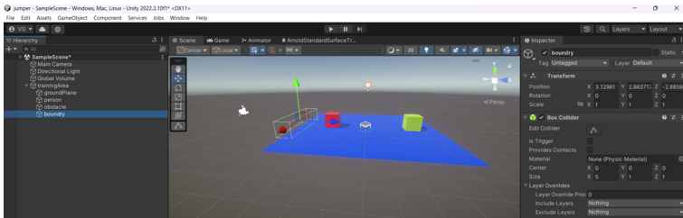
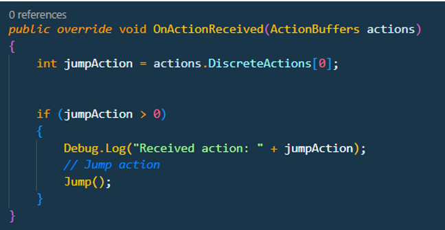

# tutorial Jumper

- Tristan Dekeyser s140498
- Gerben Van de Velde

## inleideing

We gaan een simpele blok (agent) maken die over een moving target moet kunnen springen. Deze target zal elke episode sneller bewegen.

## setup
  
  
Hier hebben we onze basic setup met een target en een agent.  
  
We geven de agent alle components dat deze nodig heeft (Behaviour Parameters & Decision Requester). De agent en target hebben beide een rigid body en boxcollider. Ten slotte geven we de agent ook een ray perception sensor om te zien hoe dicht te target is zodat deze er over kan springen.  
  
Voor het laatste deel van de setup hebben we een empty object met een boxcollider. Als de target deze aanraakt dan betekent dit dus dat onze agent erover is gesprongen en krijgt hij een reward.  
## scripts
### variabelen
  
### functies
  
Deze haalt de rigidbody’s op, neemt de startpositie van de agent en freezed de juiste assen zodat deze alleen kan springen.  
  
Deze ziet waar de target is en met welke snelheid deze op onze agent afkomt.  
  
Hier gaat hij beslissen of hij moet springen.  
  
Bij een nieuwe episode gaat hij de locaties resetten en een nieuwe snelheid aan de target geven  
  
Hiermee kan je hem handmatig laten springen met spatie voor testing.  
  
Dit is de methode waarmee hij springt.  
  
Hier wordt hij gestraft als hij de target aanraakt.  